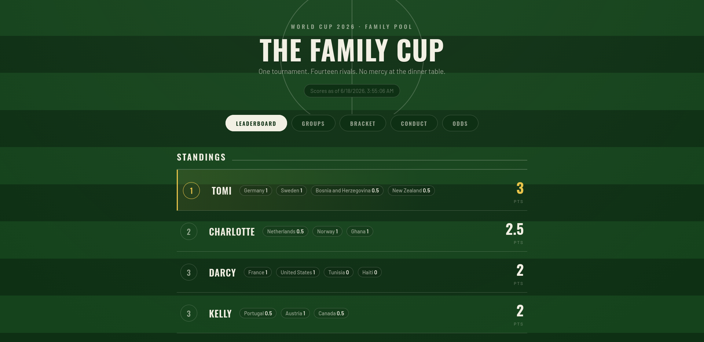
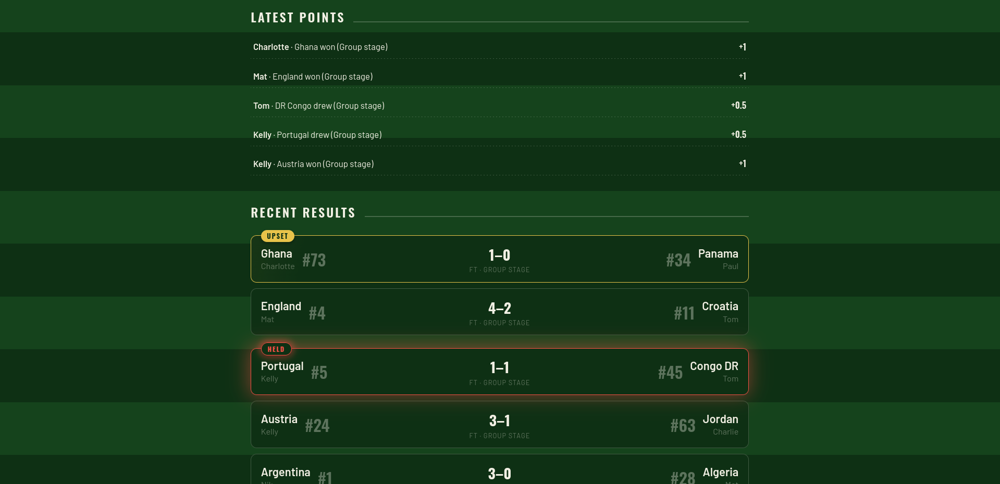
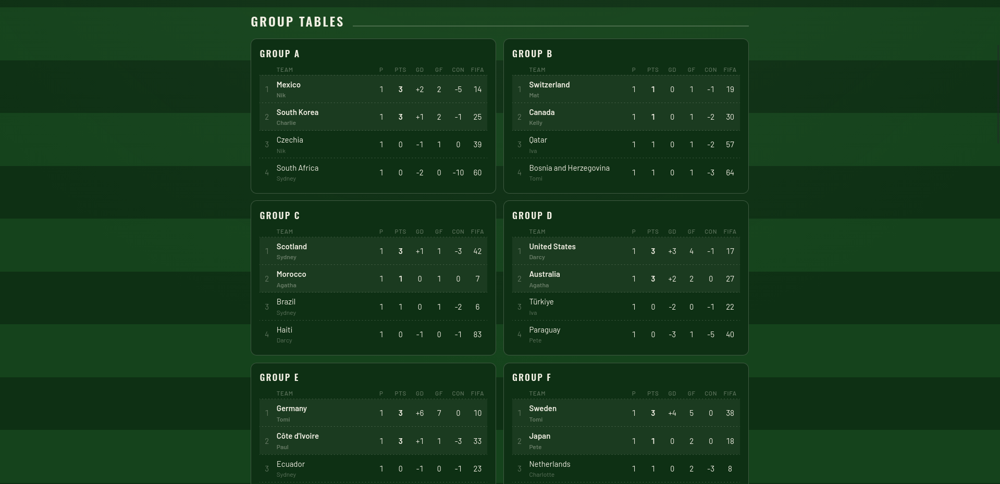
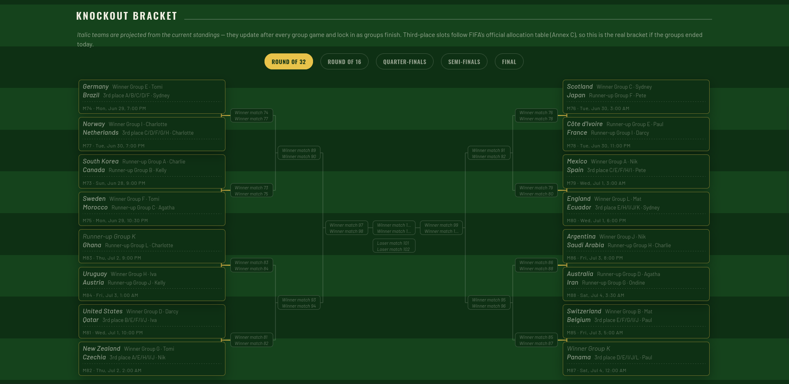
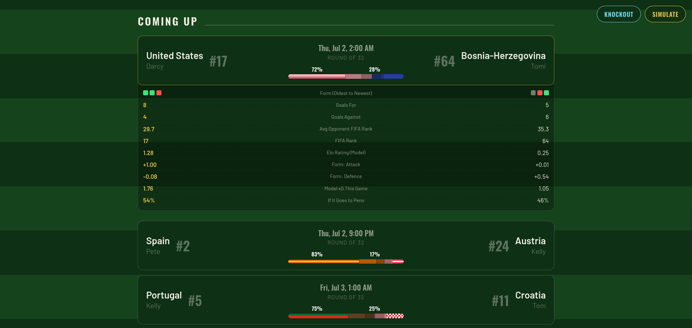
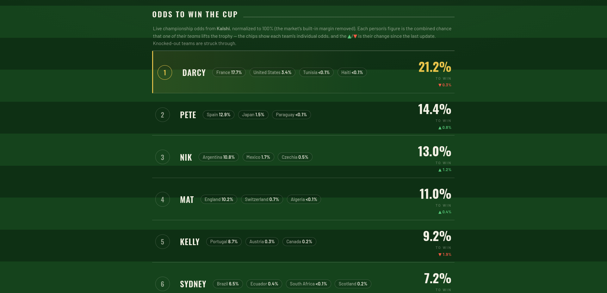
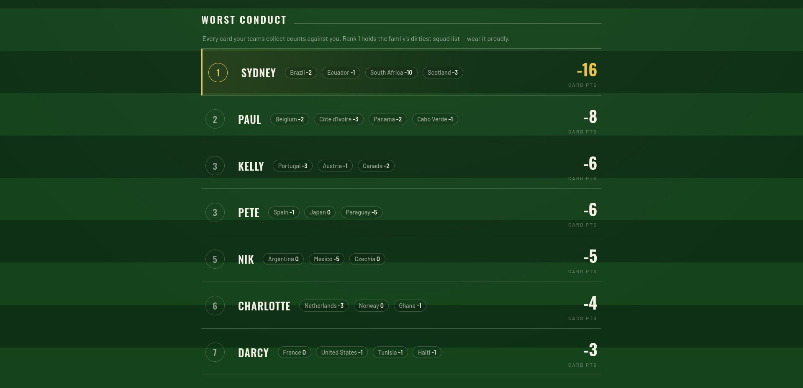

# 🏆 Family World Cup 2026 Leaderboard

A self-updating GitHub Pages site that tracks your family's World Cup 2026 pool.
A GitHub Action checks live scores every 20 minutes via the
[football-data.org](https://www.football-data.org/) API, applies your family
scoring rules, and updates the site. It also pulls live championship odds from
the betting market and runs a strength-rated tournament **simulator** right in
the browser — no server, no cost, runs by itself for the whole tournament.

## A look at the site

The leaderboard — every person's points, with their teams as chips:



<table>
  <tr>
    <td width="50%">
      <br>
      <sub><b>Recent results</b> — finished games with automatic <b>UPSET</b> (a low-ranked team beats a high one) and <b>HELD</b> (a big draw against the odds) tags, plus a live points feed.</sub>
    </td>
    <td width="50%">
      <br>
      <sub><b>Group tables</b> — all twelve groups, ordered by the full FIFA tiebreaker chain, with each team's owner underneath.</sub>
    </td>
  </tr>
  <tr>
    <td width="50%">
      <br>
      <sub><b>Knockout bracket</b> — projected from the live standings (italic = not yet locked), third-place slots placed by FIFA's official Annex C table.</sub>
    </td>
    <td width="50%">
      <br>
      <sub><b>Coming up</b> — the next fixtures with kickoff times, FIFA ranks, and which family member owns each side.</sub>
    </td>
  </tr>
  <tr>
    <td width="50%">
      <br>
      <sub><b>Odds to win</b> — live championship odds, combined per person, with each team's share and the move since the last update.</sub>
    </td>
    <td width="50%">
      <br>
      <sub><b>Worst conduct</b> — every card your teams pick up counts against you; rank 1 owns the dirtiest squad list.</sub>
    </td>
  </tr>
</table>

## Live championship odds

The **Odds** tab shows each person's live chance of owning the eventual winner.
`scripts/update_odds.py` pulls the "who wins the World Cup" market from
[Kalshi](https://kalshi.com/) — public market data, **no API key needed** —
strips the bookmaker margin so every team's implied probability sums to 100%,
and rolls each person's teams up into their combined odds. The tab shows each
team's individual share and the move since the last refresh. Run it any time
from the **Actions** tab (**Update odds → Run workflow**).

## The simulator

Every tab has a **Simulate** button. It plays the *rest* of the tournament
forward — the remaining group games, the full Annex C knockout bracket, extra
time and shootouts — instantly in your browser, and shows who lifts the trophy.
Hit it again and again to get a feel for how the draw tends to break.

It's strength-weighted, not a coin toss. Each team carries a rating in
**`elo.json`**, produced by `scripts/build_elos.py`: a 100,000-tournament Monte
Carlo that tunes every rating until the simulated champions line up with the
live Kalshi odds. So the simulator's baseline **matches the market**.

On top of that baseline it leans on what has actually happened so far — the
things a betting line is slow to price:

- **Form, weighted by who you played.** Goals scored and conceded versus the
  tournament's running average, scaled by the quality of the opponent. A 7–0
  over a top-ranked side moves a team far more than the same score over a
  minnow — and leaking goals to a minnow hurts more than leaking to a giant.
  Both group and knockout games count.
- **FIFA rank.** A small edge to the higher-ranked side, leaned on more heavily
  in the group stage than the knockouts.
- **Penalty hangover.** A team that just survived a shootout is a touch flatter
  in its next match.
- **Bigger finals.** Roughly 20% more goals are expected in the final than in a
  normal match.
- **Realistic knockout scoring.** Knockout games stay lively, around 2.3 goals a
  game in regulation, in line with recent World Cups, rather than cagey 0–0s.
- **True-to-life shootouts.** Level games go to extra time, then penalties. A
  small *Dixon-Coles* correction (the `dcRho` dial) fixes a known quirk of the
  usual scoring model, which slightly under-counts low-scoring draws: it nudges
  the 0–0, 1–1, 1–0 and 0–1 outcomes so games finish level at the real-world rate,
  without changing the total goals or who is favoured. That lifts shootouts to
  about **six a tournament**, roughly one in five knockout games, which is the
  World Cup's historical rate. With 2026's 32 knockout matches (double the old
  format), that is more shootouts in absolute terms than past editions.

Every one of these is a small, labelled dial in `elo.json`'s `params` block, so
you can nudge the model's personality without touching code.

**Keeping the ratings fresh.** The **Rebuild Elo ratings** workflow re-runs the
full calibration after each scores update (and on demand), re-anchoring every
rating to the latest results and odds — a couple of CI minutes per run. Between
those rebuilds, each **Update odds** run also gives the ratings a light nudge as
the market drifts (via `scripts/elo_nudge.py`), so the simulator always reflects
the current picture without waiting for a full rebuild.

If `elo.json` is ever missing, the Simulate button still works — it just falls
back to even, unweighted scorelines until the ratings are rebuilt.

**A what-if, never the real thing.** A simulation never touches the live
standings, and the site makes that unmistakable. Sim mode repaints the whole
page in a cool slate-blue theme (the live pages stay green), the status pill
reads "Simulated Results · Not Live", and on phones the browser bar tints to
match. A quick popup confirms before you start, and again before you head back
to the live scores, and the first time you ever simulate, a small pointer shows
you the way back. Nothing is saved: leave the what-if and the real results are
exactly as you left them.

## Scoring rules (current settings)

| Result | Points |
|---|---|
| Group-stage win | 1 |
| Group-stage draw | 0.5 |
| Round of 32 win | 2 |
| Round of 16 win | 3 |
| Quarter-final win | 4 |
| Semi-final win | 5 |
| Third-place match win | 3 |
| Final win | 6 |

Penalty-shootout wins count as full wins. Change any value in **`config.json`**
— for example, to score the bronze-medal match like a semi-final, set
`"THIRD_PLACE": 5`.

Team assignments live in **`assignments.json`**. Edit that file any time;
the next scheduled run picks it up automatically.

## One-time setup (about 10 minutes)

1. **Get a free API key.** Register at
   [football-data.org/client/register](https://www.football-data.org/client/register)
   — the free tier covers the World Cup. The key arrives by email. (This is for
   scores only; the odds feed needs no key.)

2. **Create the repository.** On GitHub, create a new **public** repo (public
   is required for free GitHub Pages), e.g. `family-world-cup`. Upload all the
   files in this folder, keeping the folder structure (the
   `.github/workflows/` paths matter). Easiest ways: drag the files into the
   GitHub web uploader, or `git push` from a Codespace/your machine.

3. **Add the API key as a secret.** In the repo:
   **Settings → Secrets and variables → Actions → New repository secret**.
   Name it exactly `FOOTBALL_DATA_TOKEN` and paste your API key as the value.

4. **Allow the workflows to push.** **Settings → Actions → General →
   Workflow permissions** → select **Read and write permissions** → Save.
   (All three workflows commit back to the repo, so this covers them all.)

5. **Turn on GitHub Pages.** **Settings → Pages** → under *Build and
   deployment*, set Source to **Deploy from a branch**, branch **main**,
   folder **/ (root)** → Save. Your site URL appears at the top of that page
   (usually `https://<your-username>.github.io/<repo-name>/`).

6. **Run it once manually.** Go to the **Actions** tab → **Update scores** →
   **Run workflow**. When it finishes green, refresh your site — real fixture
   data should appear. From then on it runs itself every 20 minutes (ideally —
   GitHub's cron is unreliable, so in practice it's every few hours. Frequent
   manual runs are fine!).

7. **Light up the odds and the simulator.** Still on the **Actions** tab, run
   **Update odds** once (fills in `odds.json` → the Odds tab), then **Rebuild
   Elo ratings** once (fills in `elo.json` → the strength-weighted Simulate
   button). No extra keys are needed. After this, **Rebuild Elo ratings**
   re-runs itself after every scores update; refresh the market whenever you
   like by running **Update odds** again.

## How it works

```
.github/workflows/update-scores.yml   schedule: fetch scores + commit (every ~20 min)
.github/workflows/update-odds.yml     manual: fetch Kalshi odds (+ nudge ratings) + commit
.github/workflows/build-elos.yml      recalibrate elo.json after each scores update + commit
scripts/update_scores.py              calls the API, applies scoring, writes data.json
scripts/update_odds.py                Kalshi championship odds -> odds.json (+ nudges elo.json)
scripts/build_elos.py                 Monte Carlo: calibrate team ratings to the odds -> elo.json
scripts/elo_nudge.py                  cheap rating nudge as odds drift (used by update_odds.py)
assignments.json                      who owns which teams
config.json                           points per round
bracket-template.json                 FIFA bracket structure + Annex C third-place map
data.json                             generated — scores, tables, bracket, simulator inputs
odds.json                             generated — championship odds per person and team
elo.json                              generated — team ratings + simulator parameters
index.html                            the website — reads data.json, odds.json, elo.json
```

Each script only commits when something actually changed, so the repo history
stays clean between match days. During live matches, scores on the site move as
the scores Action runs (and the page also re-checks itself every 5 minutes while
open). **Rebuild Elo ratings** is chained to fire right after **Update scores**,
so the moment results change, the simulator re-anchors to them.

Want the full reasoning behind the rating model — the market calibration, the
opponent-weighted form, the shootout tuning? It's all in the comments at the top
of `scripts/build_elos.py` and the `params` block of `elo.json`.

## Troubleshooting

- **Site shows "No score data yet"** — run the **Update scores** workflow once
  from the Actions tab (step 6), and check it succeeded.
- **Workflow fails with HTTP 403/401** — the `FOOTBALL_DATA_TOKEN` secret is
  missing or mistyped (step 3). (The odds and Elo workflows don't use it.)
- **Workflow fails on the push step** — workflow permissions aren't set to
  read/write (step 4).
- **Odds tab is empty** — run **Update odds** once (step 7). If a team shows 0%,
  Kalshi spelled its name differently than `assignments.json`; add a line to the
  `ALIASES` dict near the top of `scripts/update_odds.py`.
- **Simulate button does nothing or says it needs data** — it needs a recent
  `data.json` (run **Update scores**). For strength weighting it also needs
  `elo.json` (run **Rebuild Elo ratings**); without it the sim still runs but
  treats every team as even.
- **A team isn't getting points** — the scores API may spell it differently than
  `assignments.json`. Common spellings are already handled (USA, Türkiye,
  Korea Republic, Ivory Coast, Cabo Verde, DR Congo, Czechia, …). If one slips
  through, add a line to the `ALIASES` dict near the top of
  `scripts/update_scores.py`.
- **Scheduled runs stop after the tournament** — GitHub disables schedules
  after 60 days without repo activity, which is fine; you can also delete or
  disable the workflows once the final is played.
